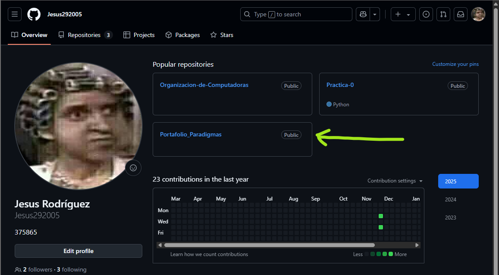

+++
date = '2025-02-21T08:43:33-08:00'
draft = false
title = 'Práctica 0'
+++

<!-- comentario -->

<!-- subtítulo -->
# PRIMERA SESIÓN:

En esta sesión se nos dió una pequeña introducción a markdown.

<!-- encabezados -->
# Encabezado 1
## Encabezado 2
### Encabezado 3
#### Encabezado 4
##### Encabezado 5

<!-- italicas -->
Este es un texto en *italicas*

Este es un texto en _italicas_

<!-- negritas -->
Este es un texto en **negritas**

Este es un texto en __negritas__

Este es un texto ~~rayado~~

<!-- UL -->
* Elemento 1
* Elemento 2
* Elemento 3
  * Elemento 3.1
  * Elemento 3.2
  * Elemento 3.3
* Elemento 4

1. Elemento 1
2. Elemento 2
3. Elemento 3
   1. Elemento 3.1
   2. Elemento 3.2
   3. Elemento 3.3
4. Elemento 4


<!-- enlances -->
[UABC](www.uabc.mx)

[UABC](www.uabc.mx "ESCUELA TOP")

<!-- imágenes -->


<!-- bloques de código -->
```c
printf("HOLA MUNDO");
printf("Este es un bloque de codigo");
printf("hola");
```

```javascript
console.log("HOLA MUNDO");
const test = ()
```

<!-- tablas -->
| Productos | Precio | Cantidad |
| --- | --- | --- |
| Laptop | 3.33 | 2 |
| Mouse | 10.33 | 1 |

| Productos | Precio | Cantidad |
| --------- | ------ | -------- |
|   Laptop  |  3.33  |    2     |
|   Mouse   |  10.33 |    1     |

<!-- tareas -->
* [X] Primera tarea
* [ ] Segunda tarea
* [X] Tercera tarea
* [ ] Cuarta tarea

<!-- menciones-->
@carrerasdecar :+1: :smile:

# SEGUNDA Y TERCERA SESIÓN:




En la segunda y tercera sesión vimos una introducción a Git y GitHub, además de crear sitios web estáticos con ayuda de HUGO y GitHub Pages. En esta imágen se puede ver cómo, con los conocimientos aprendidos en el laboratorio cree mi repositorio llamado "Portafolio_Paradigmas" en mi perfil de GitHub, en este se encuetra todo lo relacionado con el sitio web, además se encuentra una carpeta donde se organiza el contenido de las prácticas realizadas.

[Mi Respositorio](https://github.com/Jesus292005/Portafolio_Paradigmas.git "REPOSITORIO GOD")


